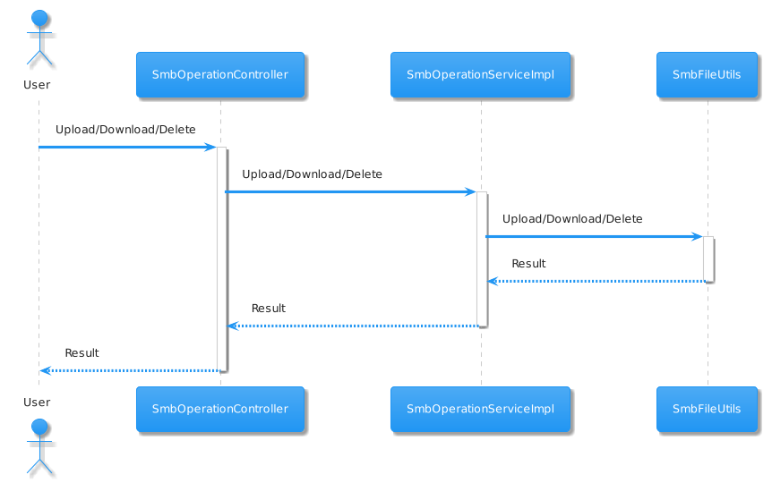

# Getting Started

An API adapter provides some base operation for new learner to study how to use SMBJ in your project.
> Smbj only supports SMB2 above version

# smbj-operation-api-adapter
## Core Flow
> Below diagram is generated by ChatGPT

