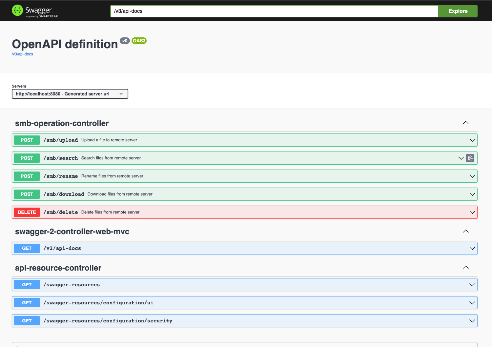

# Getting Started

An API adapter provides some base operation for new learner to study how to use SMBJ in your project.
> Smbj only supports SMB2 above version

# smbj-operation-api-adapter
## Core Flow
> Below diagram is generated by ChatGPT


## API Doc
http://localhost:8080/swagger-ui/index.html


# How To Run

## 1.SMB Upload
Change the value based on your actual needs
```json
{
    "remoteHost": "192.168.50.69",
    "shareName": "LANdrive",
    "domain": null,
    "account": "user",
    "password": "123456",
    "remoteFolder": "test/",
    "localFilePath": "/Users/evan/Downloads/Untitled video (4).mp4"
}

```


### **File in remote folder**


## 2.SMB Download
Change the value based on your actual needs
```json
{
    "remoteHost": "192.168.50.69",
    "shareName": "LANdrive",
    "domain": null,
    "account": "user",
    "password": "123456",
    "remoteFolder": "test/",
    "localFolder": "/Users/evan/Downloads/",
    "filePattern": ".*\\.mp4$",
    "fileExtension": ".d",
    "needRename": true
}
```

### **File in local folder**
> The file will be renamed to ".d" after download successfully by default

> The file has been downloaded to local storage and updated the modified time


## 3.SMB Delete
Change the value based on your actual needs
```json
{
    "remoteHost": "192.168.50.69",
    "shareName": "LANdrive",
    "domain": null,
    "account": "user",
    "password": "123456",
    "remoteFolder": "test/",
    "filePattern": "*"
}
```


### **File has been removed from remote folder**
> The file has been removed from remote folder


## 4.SMB Search
Change the value based on your actual needs
```json
{
    "remoteHost": "192.168.50.69",
    "shareName": "LANdrive",
    "domain": null,
    "account": "user",
    "password": "123456",
    "remoteFolder": "test/",
    "filePattern": ".*\\.mp4$"
}
```


### **File list in the response**
> The file will show in API response

